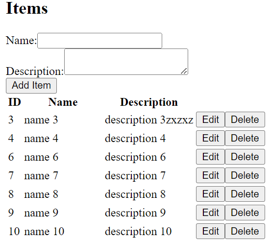

# :zap: Angular ChatGPT App

* Angular app to Create-Read-Update-Delete (CRUD) items from a MockAPI endpoint, created mostly using ChatGPT_4
* **Note:** to open web links in a new window use: _ctrl+click on link_


## :page_facing_up: Table of contents

* [:zap: Angular ChatGPT App](#zap-angular-chatgpt-app)
  * [:page\_facing\_up: Table of contents](#page_facing_up-table-of-contents)
  * [:books: General info](#books-general-info)
  * [:camera: Screenshots](#camera-screenshots)
  * [:signal\_strength: Technologies](#signal_strength-technologies)
  * [:floppy\_disk: Setup](#floppy_disk-setup)
  * [:computer: Code Examples](#computer-code-examples)
  * [:cool: Features](#cool-features)
  * [:clipboard: Status \& To-Do List](#clipboard-status--to-do-list)
  * [:clap: Inspiration](#clap-inspiration)
  * [:file\_folder: License](#file_folder-license)
  * [:envelope: Contact](#envelope-contact)

## :books: General info

**ChatGPT commands used:**

* "I have an Angular app and I want to create a CRUD with fake mockapi. Can you help?" - explained how to generate a new Angular16 app, create an API service but missed the items component and missed adding the `HttpClientModule` to `app.module.ts`. ChatGPT did not say whether routing was required or what styles menu choice to make, or that the HTML placeholder text had to be removed etc...Did not use Angular async pipe to display async Observable data directly in template. I added the typescript model interface Item myself.
* "I have an Angular app and I want to create a CRUD with fake mockapi. Can you produce the code, as well as the HTML." - produced the items component but unfinished HTML for edit and delete.
* "Can you produce just the HTML to edit and delete items from the mockapi." - produced the complete Item List HTML
* "I get an error "Can't bind to 'ngModel' since it isn't a known property of 'input'." with the HTML line [(ngModel)]="newItem.name". Do you know how to fix it?" - told me to add the FormsModule to `app.module.ts`

## :camera: Screenshots

* 

## :signal_strength: Technologies

* [Angular v16](https://angular.io/)
* [RxJS v7](https://rxjs.dev/api) Reactive Extensions Library for JavaScript
* [MockAPI.io](https://mockapi.io/projects) - you will need to sign in and create a project

## :floppy_disk: Setup

* Install dependencies using `npm i`
* Run `ng serve` for a dev server. Navigate to `http://localhost:4200/`. The app will automatically reload if you change any of the source files.
* Run `ng build` to build the project. The build artifacts will be stored in the `dist/` directory. Use the `--prod` flag for a production build.
* Run `ng update` to update Angular

## :computer: Code Examples

* methods from `items.component.ts` to get all items and add an item.

```typescript
  getItems(): void {
    this.mockApiService.get('items').subscribe((response) => {
      this.items = response;
    });
  }

  addItem(): void {
    this.mockApiService.post('items', this.newItem).subscribe((response) => {
      this.items.push(response);
      this.newItem = {};
    });
  }
```

## :cool: Features

* Minimal code to produce CRUD functionality

## :clipboard: Status & To-Do List

* Status: Working
* To-Do: Get ChatGPT to add styling

## :clap: Inspiration

* [Youtube Domini Code](https://www.youtube.com/watch?v=z7-OOCJ1eUQ) - in Spanish

## :file_folder: License

* This project is licensed under the terms of the MIT license.

## :envelope: Contact

* Repo created by [ABateman](https://github.com/AndrewJBateman), email: gomezbateman@yahoo.com
